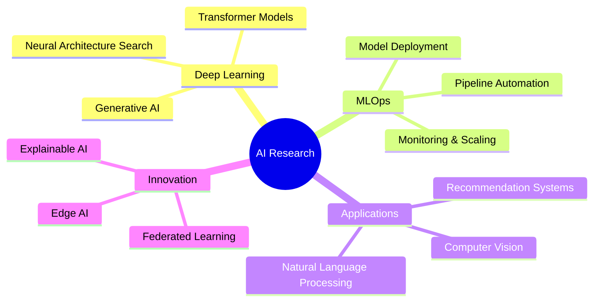

  

  
  

---

## 🏆 **Achievement Spotlight**

  
  
  
  

---

## 🛠️ **Tech Arsenal**

### **Languages & Core**

### **Machine Learning & AI**

### **Data Science & Analytics**

### **Cloud & Infrastructure**

### **Databases & Tools**

---

## 📊 **GitHub Analytics**

  
  

  

  

---

## 🚀 **Featured Projects**

<table>
  <tr>
    <td width="50%">
      <h3 align="center">🤖 AI Project Name 1</h3>
      
  
        
         
         
        

            
          
        

        
<strong>Tech:</strong> Python, TensorFlow, AWS

        
Brief description of your most impressive ML project and its impact on solving real-world problems.

      

    </td>
    <td width="50%">
      <h3 align="center">🧠 Deep Learning Project</h3>
      

        
         
         
        

            
          
        

        
<strong>Tech:</strong> PyTorch, Docker, GCP

        
Advanced deep learning solution with quantifiable impact and innovative approach to complex problems.

      

    </td>
  </tr>
  <tr>
    <td width="50%">
      <h3 align="center">📊 Data Science Pipeline</h3>
      

        
         
         
        

            
          
        

        
<strong>Tech:</strong> Scikit-learn, Flask, PostgreSQL

        
End-to-end data science solution with automated pipelines and real-time analytics dashboard.

      

    </td>
    <td width="50%">
      <h3 align="center">🎯 Computer Vision App</h3>
      

        
         
         
        

            
          
        

        
<strong>Tech:</strong> OpenCV, YOLO, FastAPI

        
Real-time computer vision application with state-of-the-art object detection and tracking capabilities.

      

    </td>
  </tr>
</table>

---

## 🎯 **Current Focus**

---

## 🌟 **GitHub Trophies**

  

---

## 🌐 **Let's Connect & Collaborate**

  
  ### 💡 "I'm always open to discussing new projects, creative ideas, or opportunities to be part of your visions!"
  
  

---

  

